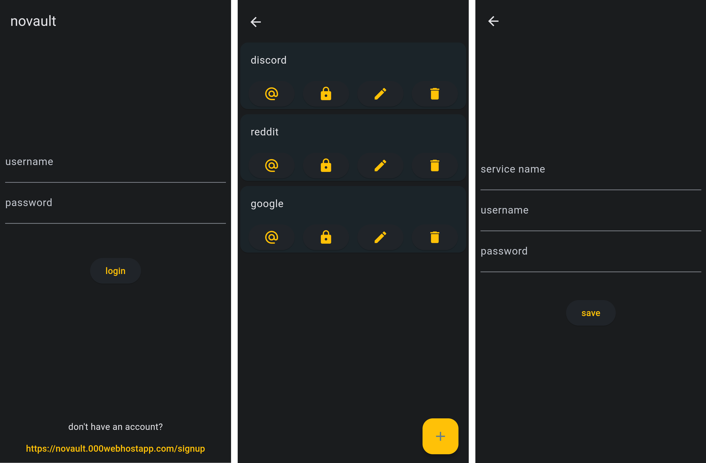

# 

## CSCI-410 project, part 2

this is part 2 of the project for the CSCI-410 course

the project demonstrates the use of flutter and dart to build production-ready mobile applications

this app is called "novault", it is an encrypted passwords vault

## what is novault?

novault is a simple password vault, it stores encrypted usernames and passwords for services/websites.

accounts are created in the signup page, and then used to login.

each entry uses the master password as the encryption key with a unique initialization vector.
the password itself is encrypted with bcrypt and stored on the server as such.
if the authentication succeeds, and the hash generated from the provided password matches the one stored on the server, it is then used as the encryption key.
each entry stores its own initialization vector with its fields, the iv is used in combination with the password to encrypt/decrypt the fields of the entry with AES256.

## external dependencies
- http (^1.1.2): used for http requests
- convert (^3.1.1): text conversions, mainly base64 and json
- encrypt (^5.0.3): encryption/decryption with AES256

## *** DO NOT USE THIS TO STORE YOUR ACTUAL PASSWORDS ***

while you technically can use it as a password vault, this is only meant as a demonstration. even though the passwords and other data are never stored in plain text, this is still not secure enough for real-life use.

in a real-life scenario, the master password would never be sent to the server.
instead, it's used for client-side decryption only, where the password manager can use key derivation functions to derive encryption keys from the master password.

novault, being only for demonstration purposes, doesn't really use a "master password". the user account password, after being authenticated, is used as the encryption key along with a random initialization vector for each entry.

i also didn't include a lot of server-side validation, which is a bad security practice for production-ready applications.

# 

*this app is unlikely to be maintained/developed further, since it's only meant to serve as a demo.
